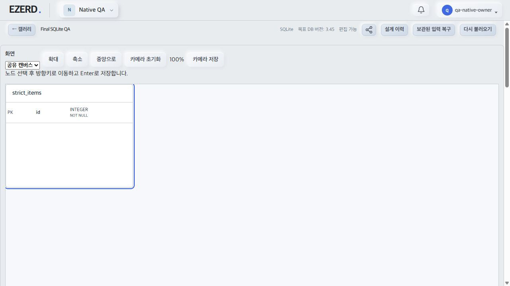
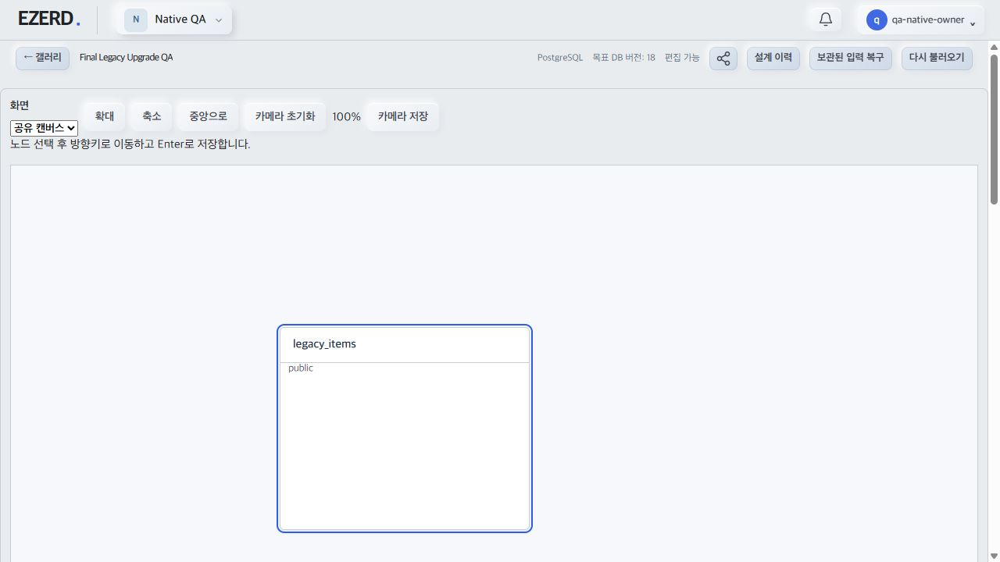

# Native 브라우저 다운로드·업그레이드 QA 결과

- [계획](../planning/2026-10-02-Database-NativeBrowserPathQA.md). 2026-10-03 실제 빌드 웹/AppModule과 전용 UUID DB에서 정상 UI 로그인으로 확인했다. 저장소·토큰 주입은 사용하지 않았다.
- MySQL 프로젝트 카드에서 Native/MySQL 선택 후 물리 items/item_id, INT UNSIGNED, 숫자 기본값 7, PK, BTREE INVISIBLE 인덱스를 실제 저장했다. 공유 메뉴 SQL 및 JSON 다운로드 파일은 각각 451/4017 바이트다. SQL SHA256 `7c2b832e9cf26ca022220398832eae5fc7c8ce9bac1de329aee67f691375db77`.
- SQLite 프로젝트는 INTEGER/PK와 STRICT·WITHOUT ROWID를 저장하고 SQL 다운로드를 확인했다. SQL SHA256 `58d59b8a891f4f73e058340072c60337355773268a68987bfdb2ddc39dac5531`.
- [재현 스크립트](../../apps/server/scripts/verify-native-browser-downloads.ts)는 위 다운로드 bytes의 SHA를 먼저 검사하고 치환 없이 실행했다. 작업 소유 MySQL8.4.11 임시 DB에서 기본값 7, `int unsigned`, INVISIBLE NO를 조회했고 finally DROP했다. SQLite3.45.0 메모리 DB에서 값 7 및 STRICT/WITHOUT ROWID `1:1`을 확인했다. PASS. Windows stdout CRLF만 정규화하고 SQL 원문은 변경하지 않았다.
- 기존 클라이언트 호환 설계에서 legacy_items 생성→기존 WS ACK→원문 보존 검토→명시 업그레이드→Native 편집 화면/legacy_items 원문 보존을 실제 확인했다. 갱신 중 구문맥 편집은 차단되고 ACK 뒤 새 화면으로 전환됐다.
- 빈 Native 프로젝트 카드 DB 변경에서 기존 웹 소비의 expectedSequence 누락이 발견됐다. 물리 설계의 기존 갤러리 경로는 변환 필요 안내로 차단됐다. C8 갤러리 소비 수정과 수정 번들 재검증은 별도 단위다. 이 결과를 DB 변경 성공으로 계산하지 않는다.
- JSON 가져오기의 파일 chooser는 열렸지만 업로드 권한이 사용자가 거부한 상태로 브라우저 정책에 차단됐다. 재시도·우회하지 않았다. 실제 브라우저 JSON 가져오기 성공은 미검증이다. 실제 REST/MCP import/export는 [actual 회귀](2026-10-03-Database-NativeActualRegression.md) 및 최종 actual 결과에 별도 기록한다.

- [MySQL SQL 원본](assets/2026-10-03-Database-NativeMySQLBrowserQA.sql), [SQLite SQL 원본](assets/2026-10-03-Database-NativeSQLiteBrowserQA.sql).
- 전체 기능 완료 및 QA 자원 정리 기록은 canonical 진행 상태와 최종 결과에 남긴다. 이 단위는 전체 완료 기록이 아니다.