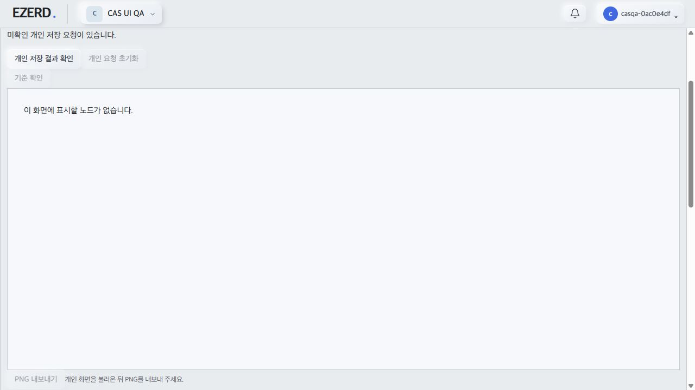
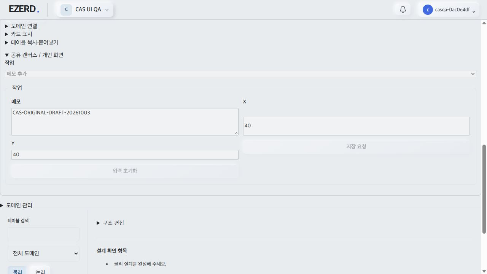
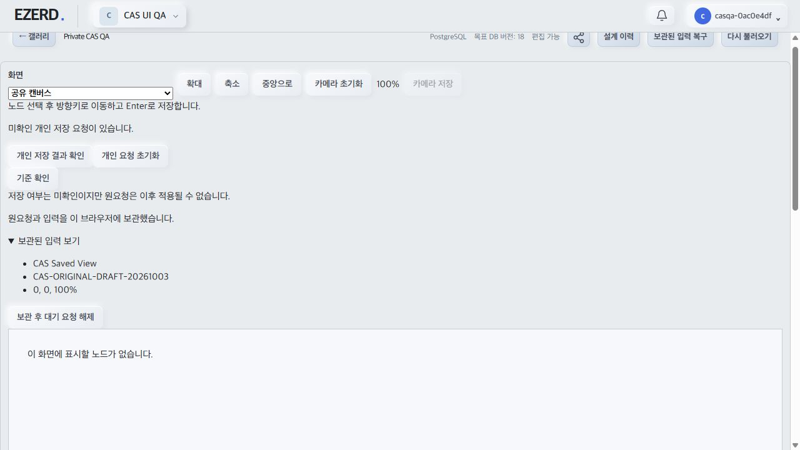
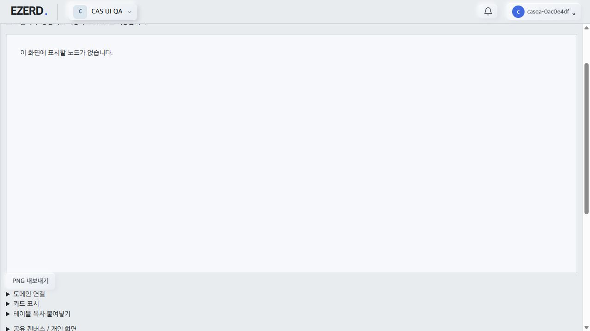
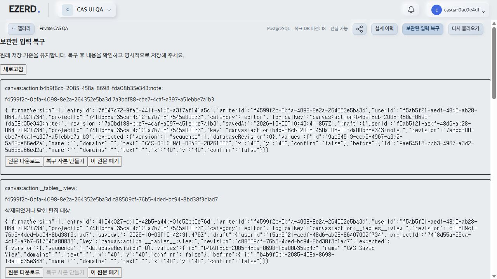

# Native private CAS 복구 실제 UI QA 결과

- 작성일: 2026-10-03
- 계획: [NativePrivateCASBrowserQA](../planning/2026-10-03-Database-NativePrivateCASBrowserQA.md).
- 상태: 실제 UI blocker 재현. archive/explicit release positive는 미확보이며 성공으로 계산하지 않는다. 생산 source/private helper, 부모 3139 서비스/탭/변수 및 Git을 변경하지 않았다.

## 격리 환경·재현

- 자체 UUID `ezerd_casqa_*` DB에 migration을 적용하고 실제 Nest API 3143과 전용 응답 유실 proxy 3144를 loopback에만 띄웠다. 기존 server/web dist를 소비했다. QA 사용자·두 API session·workspace·native format2 프로젝트·공유 domain은 일반 API로 생성했다.
- 새 own-prefix 브라우저 탭 A에서 QA owner/PIN으로 명시 로그인했다. UI에서 개인 `CAS Saved View`를 생성·정상 저장했다. 실제 personal PUT 200, personal version 0→1이며 projectVersion=1/syncSequence=1/databaseRevision=0이었다.
- private view 메모 form에 합성 원문 `CAS-ORIGINAL-DRAFT-20261003`을 입력했다. 다음 personal PUT만 middleware에서 가로챘다.
- middleware는 별도 정상 API session의 GET→PUT로 기존 personal view 이름을 변경했다. 실제 PUT 200, version 1→2. 원요청 expectedVersion은 1이었다. DB row의 version/state를 직접 조작하지 않았다.
- 원래 browser PUT을 그대로 실제 backend에 전달하여 실제 409를 받고 응답 socket을 끊었다. 브라우저가 같은 요청을 자동 재전송한 것으로 보이는 추가 실제 PUT 409도 관찰됐다. 최초 response loss와 이후 409 전달을 구분한다. 결과를 임의 accepted/rejected JSON으로 조작하지 않았다.
- A UI는 미확인 개인 저장 요청과 원문 입력을 유지했다. 일반 개인 요청 초기화는 disabled였다. 그러나 CAS `기준 확인`도 disabled여서 사용자 fresh GET proof/archive/release 경로로 진행할 수 없었다.
- 별도 탭 B에서 같은 QA owner/PIN으로 로그인하여 같은 프로젝트를 열었다. pending 재현 및 `기준 확인` disabled를 확인했다. B의 독립 입력 또는 두 탭 draft roundtrip을 통과로 계산하지 않는다.
- A의 `개인 저장 결과 확인`은 실제 fresh GET 200/version 2를 받고 `native.personal-conflict`를 표시했다. 원문과 pending은 유지되고 CAS proof 버튼은 계속 disabled였다. 같은 version GET/404는 positive로 계산하지 않았다.

## 최소 blocker·부모 수정 요청

- `NativeProjectView.tsx:134–136`: durableState가 empty 이외이면 queueBlocked이며 editorBusy에 포함된다.
- 같은 파일 `NativeERDCanvas busy={editorBusy}` 전달로 private unknown/pending 자체가 Canvas busy가 된다.
- `NativeERDCanvas`의 NativePrivateCASRecovery에 `disabled={busy || personalBusy}`를 전달하므로, 원래 이 recovery가 해제해야 할 private unknown/pending에서 proof 버튼부터 잠긴다. proof 후 queue 상태가 pending이 되어도 같은 root 조건은 release를 잠글 수 있다.
- 부모는 일반 edit/새 저장 queue 차단을 유지하면서 own private proof/확인된 local release에 필요한 실제 operation busy를 분리해 전달해야 한다. actor/project guard, 실제 active transmission fence, unknown 상태의 일반 discard 차단을 제거하는 수정은 요청하지 않는다.
- 소스는 수정하지 않았으며 DOM disabled/storage 조작으로 우회하거나 standalone helper 성공을 실제 UI 성공으로 대신하지 않았다. 부모 수정·최신 web build 이후 같은 API 재현으로 archive/explicit release를 재검증해야 한다.

## Sanitized 증거

| 실제 단계 | 결과 |
| --- | --- |
| UI 개인 view 정상 저장 | PUT 200, personal version 1 |
| 별도 writer 정상 CAS advance | PUT 200, version 1→2 |
| 원 PUT handler 검증 후 응답 유실 | 실제 409, expectedVersion 1 |
| 이후 browser PUT | 실제 409 관찰 |
| 일반 복구 UI fresh GET | 200, personal version 2, native.personal-conflict |
| unknown pending·A 원문 유지 | 확인 |
| 새 탭 B pending/proof 차단 재현 | 확인 |
| CAS UI archive / explicit release | blocker로 미검증 |
| active/expired lease 및 두 별도 draft roundtrip | 미검증 |

- 숨겨진 browser storage/cookie/token을 읽지 않았다. API 로그인 token은 harness 메모리에서만 사용하고 출력/문서에 남기지 않았다. 화면/로그에는 자체 합성 QA 값과 counter/status만 남겼다.
- initial harness migration은 QA 포트와 .env MCP URL 문맥 문제로 한 번 실패해 자체 DB가 즉시 정리됐다. 환경 값을 전용 포트로 맞춘 후 실행했다. non-TTY stdin 종료로 한 번 조기 정상 cleanup이 있었고, 이후 own TTY 세션으로 서비스를 유지했다. 제품 실패와 구분한다.

## 정리

- 자체 3143/3144 listener·UUID DB·임시 스크립트·두 own 탭 정리 결과는 아래에 완료 후 기록한다. 부모 3139 및 다른 agent 자원에는 접근하지 않는다.

## 부모 조사 대기·재검증 지원 상태

- 부모의 정리 중단 지시 후 읽기 확인: 자체 DB `ezerd_casqa_c27be225202e469fbba54f7702f5f72d`는 존재한다. own 3143/3144 listener는 없고, 기존 own PID 34976 및 tool 입력 세션은 더 이상 사용할 수 없다. 정리가 완료됐다고 주장하지 않는다.
- 임시 harness `apps/server/scripts/casqa-oct03-owned.tmp.mjs`는 남아 있다. middleware 주입은 프로세스 메모리 상태였으므로 현재 활성 주입/hold 요청은 없다. 부모 서비스는 조작하지 않았다.
- own 브라우저 binding은 재개된 도구 세션에서 사라져 기존 두 탭의 실제 종료 여부는 미확인이다. hidden storage/token은 읽거나 지우지 않았다.
- 기존 DB를 read-only로 보존하고 추가 생성/삭제/PUT은 중단했다. 부모 수정·web build 이후 같은 UUID DB를 재사용하여 own listener를 재시작하고 명시 QA owner/PIN 로그인으로 재검증할 수 있다. 기존 harness는 신규 DB 생성 형태이므로 재시작 때 재사용 모드를 자체 임시 스크립트에만 연결해야 한다.

## 수정 빌드의 실제 UI 재검증 결과

- 부모 CAS root busy fix ce44b4와 production asset `/assets/index-DrF9-JJ5.js`를 실제 새 탭 DOM의 script src로 확인했다. 자체 harness의 reuse mode로 기존 UUID DB/동일 프로젝트/동일 QA actor를 재사용했다. 이 재검증에서는 새 pending이나 browser storage를 직접 주입/삭제하지 않았다.
- 기존 unknown pending이 그대로 표시됐으며, 일반 개인 요청 초기화는 disabled지만 CAS `기준 확인`은 enabled였다. 원래 expectedVersion=1, 서버 개인 version=2, shared version/sequence/revision=1/1/0 상태를 유지했다.
- A가 명시 `기준 확인`을 클릭해 실제 fresh personal GET 200/version 2를 소비하고 원요청의 CAS 기준 소멸 proof 및 archive를 생성했다. 보관된 입력 보기에서 원래 view 이름과 `CAS-ORIGINAL-DRAFT-20261003`을 확인했다. 즉시 자동 해제되지 않고 explicit release 버튼이 나타났다.
- B도 동일 QA owner/PIN으로 명시 로그인하여 같은 pending/기존 archive를 읽었다. B의 release는 fresh 확인 전 disabled였고, B가 별도 명시 기준 확인으로 GET 200/version 2를 소비한 뒤 enabled가 됐다. A/B 양쪽 archive UI에서 동일 원문을 확인했다.
- A가 명시 `보관 후 대기 요청 해제`를 클릭했다. 이후 A/B 모두 CAS pending card count=0이었다. reuse harness의 이 단계 API 기록은 GET뿐이며 개인 version=2 및 서버 notes=[]는 그대로다. CAS archive/explicit release를 성공 저장 ACK나 서버 PUT 재생으로 계산하지 않았다.
- 해제 후 제품의 `보관된 입력 복구` UI에서도 원래 draft JSON의 values.text=`CAS-ORIGINAL-DRAFT-20261003`과 원래 expected version/sequence/revision=1/1/0을 확인했다. 활성 메모 form은 새 입력 상태지만 원문 archive는 별도로 보존돼 있었다. 숨겨진 storage/cookie/token을 읽지 않았다.
- 최초 필수 경로(response loss/다른 writer CAS advance → 기존 unknown pending 보존 → 수정 빌드 fresh GET proof → 원문 archive → explicit release → 해제 후 원문 보존) **실제 UI 통과**. 이전 blocker 결과는 수정 전 기록으로 유지하며 성공으로 덮어쓰지 않는다.
- 두 별도 미저장 draft의 동시 수정/roundtrip, active/expired lease 시나리오는 이번 우선 재검증에서 추가 실행하지 않았다. 같은 version GET/404, helper-only 또는 임의 storage 조작을 positive로 계산하지 않았다.

- 부모의 hold 해제/재개 지시에 따라 결과 기록 후 자체 listener/DB/임시 스크립트/own 탭을 정리하고 확인 결과를 추가한다. 생산 코드 변경과 Git 작업은 없다.

## 최종 자체 자원 정리 확인

- own 두 탭은 각각 close 성공 응답을 확인했다. 부모 탭/변수는 사용하거나 닫지 않았다.
- own 입력 세션에서 stop으로 3143/3144를 정상 종료했고, 재사용 DB는 그 단계까지 보존했다.
- 이후 명시된 자체 DB `ezerd_casqa_c27be225202e469fbba54f7702f5f72d`만 drop했다. pg_database의 동일 이름 조회로 미존재를 확인했다. 3143/3144 listen count=0, own 임시 harness 파일 미존재를 확인했다.
- 보존 산출물은 계획/결과 문서와 sanitized 화면 증거뿐이다. 브라우저 storage/cookie/token을 강제로 읽거나 삭제하지 않았다. 두 다른 미저장 draft·active/expired lease의 추가 QA는 미검증으로 남긴다.
