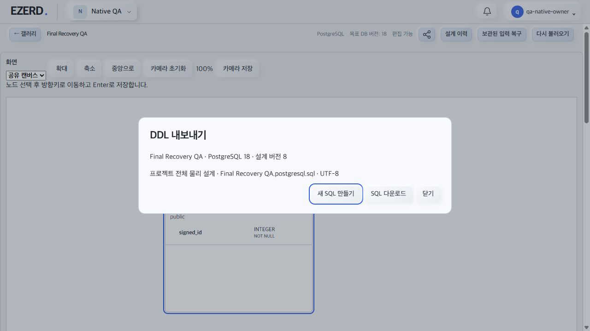

# Native 갤러리 DB 변경·복구 실제 브라우저 QA

- [계획](../planning/2026-10-03-Database-NativeGalleryBrowserQA.md), [소비 구현](2026-10-04-Database-NativeGalleryConversion.md). C8 bundle index-CzPIIWOA.js와 실제 AppModule을 작업 소유 DC UUID DB의3139/3150 loopback에서 사용했다. 정상 QA owner/viewer 로그인으로 검사했으며 브라우저 저장소·토큰을 주입하거나 검사하지 않았다.
- 빈 Native PostgreSQL 프로젝트에서 갤러리의 DB 변경→SQLite 검토/명시 확인→적용→SQLite 카드 표시를 확인했다. 구형 preview/metadata 경로의 실제 실패를 수정 소비 경로의 성공으로 확인했다.
- 물리 legacy_items/signed_id는 최초 PG INTEGER에서 MySQL INT로 변환했다. 검토에서 객체 이름과 INTEGER→INT, public→현재 DB, InnoDB 옵션 전후 값이 표시됐다. 최초 socket drop에서는 브라우저가 자동 재전송했으므로 이를 수동 unknown 복구로 계산하지 않았다. DB 원장은1행, version6/sequence5/revision2와 별도 이름 Final Converted QA를 확인했다.
- 두 번째 실제 시험은 MySQL→PG 및 이름 Final Recovery QA다. 프록시가 성공한 upstream ACK를 drain하고 HTTP502로 대체해 실제 저장 결과를 받지 못한 상태를 만들었다. 서버는 version7/sequence6/revision3 및 원장 총2행, 이름 Final Converted QA를 유지했다. 화면은 원래 요청과 이름 입력을 보존하고 수동 재확인 버튼을 제공했다.
- reload 뒤 복구 진입점이 남았고, 화면의 원문에서 operation b2c2c6f3-8896-4dee-93ab-987331aa1c64, 기대6/5/2 및 원래 이름 입력이 동일했다. 같은 요청 재확인→기존 ACK→최신 version으로 이름만 저장→미확인 진입점 제거를 확인했다. 최종 version8/sequence6/revision3, 동일 operation 원장1행, 원장 전체2행이다. 계획한 변환 문서의 fingerprint와 실제 저장 문서가 같고 테이블/컬럼 ID가 보존됐다.
- 이후 물리 PG→SQLite 검토는 영향 객체·미검증 변환 진단과 적용 disabled를 확인했다. 취소 후 source/counter 보존을 검사한다. 별도 viewer 로그인에서는 실제 Native 조회 전용 화면과 INTEGER NOT NULL 원문을 읽을 수 있었다.
- 공유→DDL 내보내기에서 PostgreSQL18/설계8/프로젝트 전체 물리 설계와 파일명을 확인했다. 실제 다운로드189바이트, SHA256 bf5b641942829b944e311aef440ca3b304e9a552ebce2ac61baf1d0d4c89f10b. 치환 없이 별도 UUID PG18.6 DB에 실행하고 값7 및 integer/NOT NULL metadata를 확인했다. finally 정확한 DB를 DROP했다.
- [비교 증거](assets/2026-10-04-Database-NativeGalleryBrowserQA.json), [다운로드 원본 SQL](assets/2026-10-04-Database-NativeConvertedBrowserQA.sql).

- JSON 파일 업로드는 앞선 브라우저 권한 거부를 재시도·우회하지 않았다. 이 경로의 실제 브라우저 import 성공은 미검증이며 REST/MCP 검증과 구분한다.
- ordinary409 stale proof의 모든 경쟁/lease/quota 분기는 실제 HTTP2소켓 또는 브라우저 전체 조합으로 검사한 것으로 주장하지 않는다. 모델-backed transport/별도IDB·실제 서비스의 단조 카운터/구원장 정책 검증 및 이 단위의 실제 response-loss 재로드/동일 ACK 경로를 함께 근거로 사용한다.
- 후속 최종 기록에서 listener·프록시·남은 정확한 QA DB·MySQL container/SQLite CLI 및 임시 harness 정리를 기록한다.