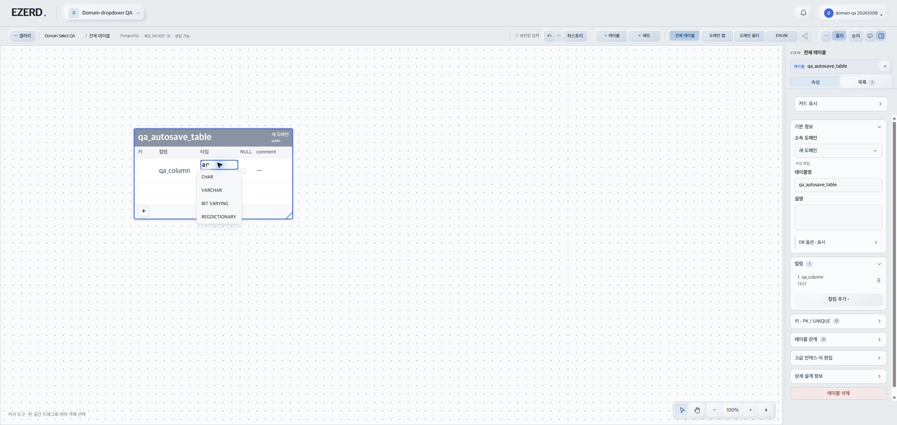
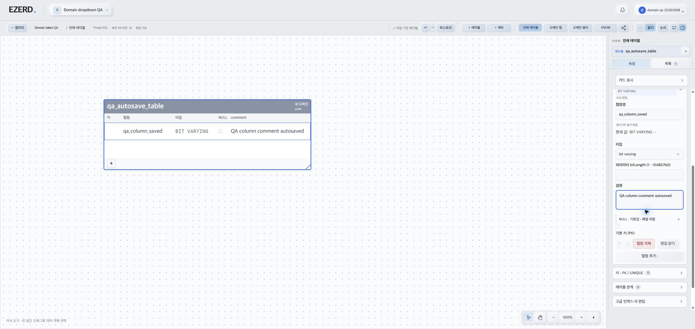

# 브라우저 QA 기록

## 최종 후속 검증

- 아래 중간 검증에서 발견한 첫 글자 누락과 마우스 옵션 선택 실패는 수정 후 Chrome에서 모두 통과했다.
- var 연속 입력, 마우스 VARCHAR 선택, 새로고침 후 타입 보존, 새 도메인 소속 변경·보존, 고급 식 편집 계층도 확인했다. [후속 결과와 스크린샷](2026-10-08-TypePicker-BrowserFixResult.md)을 참조한다.
- 아래는 수정 전 재현과 당시 범위를 기록한 이력이다.

## 중간 상태: 타입 입력 실패 확인, CUA 소유권 Volta 인계

- 대상: http://127.0.0.1:5174 임시 DB. 실제 브라우저 UI 입력으로 검증했다.
- 최초 IAB 연결 차단 후 오너 조정에 따라 Chrome 전용 QA 탭을 생성해 진행했다. 연결 차단은 현재 차단 사유가 아니다.
- Chrome browser `2`, tab `322938569`, 세션 `🧪 EZERD QA`. 다른 기존 탭은 조작하지 않았다.
- 오너 요청으로 QA를 중단하고 탭을 후속 작업용으로 유지했다. CUA 소유권은 Volta에게 인계되었으며 이후 브라우저 조작은 수행하지 않는다.
- 카드 버그 수정 후 새 도메인 소속 선택·고급식 등 후속 QA는 오너의 재요청에 따라 진행한다.
- 소스 수정·git add·commit은 수행하지 않았다. 최종 전체 통과 판정이 아니다.

## 검증 환경과 현재 데이터

- QA 사용자: `Domain QA 20261008`.
- 워크스페이스: `Domain dropdown QA` / 프로젝트: `Domain Select QA`.
- 테이블: `qa_autosave_table` (이전 `domain_qa_table`).
- 컬럼: `qa_column_saved` (생성 당시 빈 이름 → `qa_column`). 설명: `QA column comment autosaved`.
- 컬럼 타입: 키보드 비교 검증에서 선택·저장한 `BIT VARYING`.
- 도메인: 기존 `새 도메인`, 새로 생성·수정한 `QA Domain Saved Final`.
- 마지막 관찰 화면: 전체 테이블. 새 도메인으로의 소속 변경은 아직 수행하지 않았다.

## 결과 요약

| 검증 항목 | 상태 | 실제 관찰 |
| --- | --- | --- |
| 테이블명 blur 없는 자동저장 및 reload | 통과 | `qa_autosave_table` 입력 후 다른 필드로 이동하지 않고 저장 완료 확인. ACK 후 같은 input 포커스 유지. reload·프로젝트 재진입 후 값 유지. 정확히 300ms의 지연을 계측한 것은 아님. |
| 카드 + 빈 컬럼 생성·포커스 | 통과 | 이름이 빈 컬럼 생성, 카드 컬럼명 input으로 자동 포커스. |
| 타입 var 연속 입력 | 실패 관찰 | 최초 검색 시작 시 var가 ar로 누락. DOM 값·스크린샷 일치, 포커스 유지. 열린 상태 재입력은 정상. |
| VARCHAR 마우스 선택 | 실패 관찰 | AX 클릭과 Playwright option 클릭 후에도 팝업·입력 var 유지. 키보드 ↓+Enter는 BIT VARYING 선택·저장 성공. |
| 타입 prefix 표시 없음 | 부분 확인 | 검색 옵션은 VARCHAR 등으로 표시되어 postgresql: prefix가 보이지 않음. VARCHAR 선택 완료 후 최종 표시 검증은 미완료. |
| 사이드바 필드 순서 | 통과 | 컬럼명 → 타입/타입 파라미터 → 설명 순서. |
| 옵션 기본 접힘 | 통과 | 테이블 DB 옵션·표시 및 컬럼 NULL·기본값·배열 차원 접힘 확인. |
| 컬럼 이름·설명 자동저장 및 reload | 통과 | 사이드바에서 각각 blur 없이 저장 완료, ACK 후 해당 입력 포커스 유지. reload·재진입 후 이름과 설명 유지. |
| 도메인 생성→수정 전환·연속 입력 | 통과 | QA Domain Saved 입력 후 저장. 폼이 도메인 수정으로 전환되고 이름 input 포커스 유지. Final 연속 입력 후 같은 도메인 변경, 도메인 수 2 유지로 중복 생성 없음 확인. |
| 기존 소속 Select 저장 영속화 | 통과 | 이전 IAB에서 선택한 새 도메인이 새 Chrome 세션의 카드·소속 Select에도 표시됨. |
| 새 생성 도메인으로 소속 Select 변경·reload | 미실행 | QA Domain Saved Final로 변경하는 단계는 중단 시점까지 미실행. |
| 고급식 계층화 | 미실행 | 카드 버그 수정 후 후속 QA 필요. |

## 실패 1: 최초 타입 검색에서 첫 글자 누락

실제 한 번 관찰한 재현이며 최신 수정본에서의 반복 재현은 아직 완료하지 않았다.

1. Domain Select QA 프로젝트의 qa_autosave_table 카드 +로 빈 컬럼을 만든다.
2. 카드 컬럼명에 qa_column을 입력하고 자동저장 완료를 확인한다.
3. 카드 TEXT 타입 셀을 클릭하여 qa_column 타입 combobox를 연다.
4. 해당 combobox에 `fill('')`를 수행한다.
5. 같은 도구 호출에서 즉시 동일 combobox에 `pressSequentially('var')`를 수행한다.
6. 실제 입력값은 ar가 된다. AX와 읽기 전용 DOM 관찰 모두 이를 확인했다. DOM 결과는 `{ focused: true, value: 'ar' }`였다.
7. 목록에는 CHAR, VARCHAR, BIT VARYING, REGDICTIONARY가 표시되었다.
8. 팝업이 열린 상태에서 Ctrl+A 후 var를 다시 연속 입력하면 정상 유지되었다.

입력에 사용한 호출:

```js
await chromeQA.playwright.getByRole('combobox', { name: 'qa_column 타입', exact: true }).fill('');
await chromeQA.playwright.getByRole('combobox', { name: 'qa_column 타입', exact: true }).pressSequentially('var');
```

- 당시 `chromeQA.dev.logs({ levels: ['error', 'warn'], limit: 20 })` 결과: `[]`.
- 원인 추정은 확정하지 않았다. 최초 검색 시작과 이미 열린 팝업에서의 입력을 구분해 재검증해야 한다.



## 실패 2: VARCHAR 옵션 마우스 선택이 반영되지 않음

1. 위 검색창이 열린 상태에서 Ctrl+A 후 var를 입력해 정상 var 상태를 만든다.
2. 표시된 VARCHAR 옵션을 AX index로 클릭한다.
3. 화면에는 var와 검색 팝업이 그대로 남는다.
4. DOM snapshot에서 option VARCHAR를 확인하고 `getByRole('option', { name: 'VARCHAR', exact: true }).click()`으로 다시 클릭한다.
5. 동일하게 팝업·입력 var가 유지되었다.
6. 비교를 위해 combobox에서 ArrowDown 후 Enter를 누르자 BIT VARYING이 선택·저장되었다.

- 두 번의 클릭은 같은 열린 팝업에서 서로 다른 도구 접근으로 시도한 것이다. 독립적인 새 세션 2회 재현을 의미하지 않는다.
- 직후 console error/warn 결과도 `[]`였다.
- 이 실패만의 별도 스크린샷은 수집하지 못했다. AX·DOM 결과로 확인했으며 타입 검색 스크린샷은 첫 글자 누락 상태의 증거다.
- 이후 Vite 전체 갱신이 발생해 최신 코드에서의 재현·최종 VARCHAR 표시 검증은 미완료다.

## 저장·포커스 증거와 개발 서버 갱신 영향



- 위 화면 저장 직전 저장 상태는 ✓ 저장 기준 확인됨이었다. DOM active element는 `{ active: 'TEXTAREA', value: 'QA column comment autosaved' }`였다.
- 테이블명과 컬럼명 ACK 후에도 AX의 focused element는 각각 입력 중인 동일 필드였다.
- 도메인 생성·연속 수정 후 DOM 관찰에서 이름 input은 focused: true, 값은 QA Domain Saved Final이었다.
- QA 중 다른 워커 소스 변경으로 Vite 전체 갱신이 발생해 갤러리로 돌아가는 중단이 여러 차례 있었다. 콘솔에 2026-10-07T15:56:09Z 무렵 hot updated, invalidate ... Could not Fast Refresh (... export is incompatible), 이후 [vite] connecting.../connected.가 관찰되었다.
- 해당 갱신에는 NativeSelectedObjectInspector, native-clipboard, native-editor-expression 등의 로그가 포함됐다. 이 개발 서버 갱신에 따른 포커스 소실은 제품 입력 포커스 실패로 판정하지 않았다.

계획: [브라우저 QA 계획](../planning/2026-10-08-Editor-BrowserQAPlan.md)
